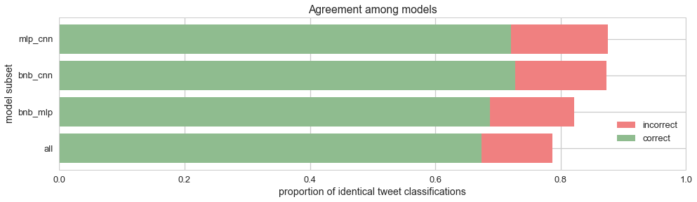
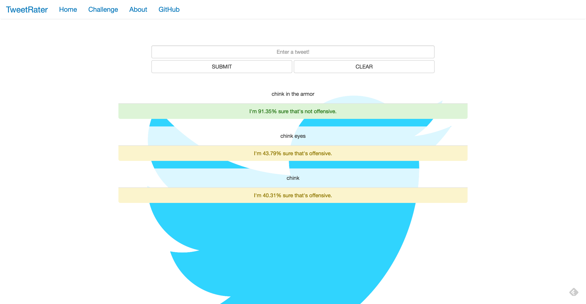

# Identifying Offensive and Hate Speech in Tweets
---
In this personal machine learning project, a number of classification techniques were evaluated for rating tweets as either non-offensive, offensive, or hate speech, which is distinguished from offensive speech in that it is used to express hatred towards or humiliate a targeted group and its members. The models were trained, tuned, and tested on a pre-labeled dataset of tweets with crowd-sourced classifications, and the most accurate model formed the basis for [TweetRater](http://tweetrater.pythonanywhere.com), a simple web application that accepts new user-supplied tweets and attempts to classify them by offensiveness.

#### Contents

- [Data](#data)
- [Preprocessing](#preprocessing)
- [Naive Bayes](#naive-bayes)
- [Multilayer Perceptron](#multilayer-perceptron)
- [Convolutional Neural Network](#convolutional-neural-network)
- [Analysis](#analysis)
- [Web App](#web-app)

## Data
[Crowdflower](https://data.world/crowdflower/hate-speech-identification) distributs a dataset of 14,509 tweets in which each tweet is categorized as non-offensive, offensive, or hate speech by a panel of three judges (a small number of tweets are rated by more than three judges). In addition to an offensiveness classification, the data for each tweet also includes a 'confidence' metric. Without a codebook, it is difficult to definitively determine how 'confidence' is calculated, though given its distribution and value range, a reasonable interpretation is that it measures the extent of agreement amongst the individual judgements for each tweet.

With regards to offensiveness ratings, the dataset is somewhat unbalanced, with half of the tweets classified by contributors as non-offensive, one-third as offensive, and the remaining 17% as hate speech.

## Preprocessing
Because tweets are short by nature and 14,509 tweets is a relatively small number of samples in the context of natural language processing, preprocessing was necessary to limit the variety of tokens in the dataset. In particular, all user handles (ex: @username) were replaced with a placeholder, and all URL's and select special characters were removed.

To further keep the corpus's vocabulary size commensurate with the dataset's size, all remaining tokens were replaced by their lemmas. Lemmization, the process of removing inflectional endings of words to return them to their base form, is not a typical preprocessing step for two of the models discussed later: a multilayer perceptron and a convolutional neural network. However, initial experiments showed that because of the limited dataset size, such token normalization enhanced the performance of these models.

Finally, the dataset contains a number of duplicate tweets, which when removed, reduces the number of tweets to 13,086. Of these tweets, 30% was held out and stratified to maintain class balance for testing while the remainder served as the training set.

|Data|# Tweets|
|---|---|
|Training|9160|
|Test|3926|

## Naive Bayes
Naive Bayes classifiers are based off Bayes' theorem of conditional probability, and though they are simple, have performed well particularly for text classification. They are labelled naive because the model assumes conditional independence of features, that is, the presence of a word in a tweet does not affect the probability of other words being observed in the same tweet. Though this assumption does not hold, in practice, the violation of conditional independence does not significantly undermine the accuracy of Naive Bayes in text classification.

For classifying tweets by offensiveness, three variations of Naive Bayes were tested, in increasing order of complexity:

1. Bernoulli Naive Bayes with term presence vectors
2. Multinomial Naive Bayes with term frequency vectors
3. Multinomial Naive Bayes with TD-IDF

#### Bernoulli Naive Bayes with term presence vectors
In a Bernoulli Naive Bayes model, each tweet is converted to a vector of binary values, where each value indicates the absence or presence of a term from the corpus vocabulary. In vectorizing the tweets and then training on them, additional hyperparameter considerations were made through a simple grid search:

|Hyperpameter|Value|Description|
|---|---|---|
|min_df|0.008|All terms that appear in less than 0.8% of all training tweets are removed from the vocabulary so as to prevent the model from overfitting on their infrequent presence.|
|max_df|0.11|All terms that appear in greater than 11% of all training tweets are removed from the vocabulary as they are such common words that they contribute little useful information about the tweet while contributing to the size of the vocabulary.
|alpha|0.35|A value for calculating a fail-safe probability in the event of observing an unknown term in the test data.|

As a result of the min_df and max_df hyperparameter values, the corpus vocabulary was reduced from roughly 16,000 terms to 168 terms.

#### Multinomial Naive Bayes with term frequency vectors
In a Multinomial Naive Bayes model, term frequency vectors are used in place of term presence vectors. The two are the same except that a term frequency vector contains values counting the number of times a term appears in a tweet rather than indicating whether a term is merely present. A grid search for optimal hyperparameter values returned the same as those for Bernoulli Naive Bayes.

#### Multinomial Naive Bayes with TF-IDF
The term frequency-inverse document frequency vectorization of a tweet takes the term frequency vectorization a few extra steps. First, whereas previously a term frequency vector consisted of integers representing the multiplicities of terms within a tweet, TF-IDF normalizes these values by dividing each vector element by the number of terms in the tweet. Thus, additional information about the length of a tweet is incorporated into the model. The IDF part of the model then weights each element of the vector, penalizing terms that appear too frequently in other tweets and boosting rarer terms.

|Hyperpameter|Value|Description|
|---|---|---|
|min_df|0.004|All terms that appear in less than 0.8% of all training tweets are removed from the vocabulary so as to prevent the model from overfitting on their infrequent presence.|
|max_df|0.112|All terms that appear in greater than 11% of all training tweets are removed from the vocabulary as they are such common words that they contribute little useful information about the tweet while contributing to the size of the vocabulary.
|alpha|0|A value for calculating a fail-safe probability in the event of observing an unknown term in the test data.|

As a result of the min_df and max_df hyperparameter values, the corpus vocabulary was reduced to 369 terms.

#### Results
In addition to accuracy, three other metrics were used to assess and compare the Naive Bayes variations' performance on test data:

- **Weighted F1**: Because the data is inherently unbalanced with regards to offensivess ratings, an F1 score can serve to check the usefulness of the accuracy score. A weighted F1 score is a weighted average of F1 scores for each rating and serves as a compromise between micro-averaging and macro-averaging a multi-class F1 score.
- **2-Class Accuracy**: The accuracy of the model if offensive and hate speech tweets were collapsed into one class.
- **2-Class F1**: The F1 score of the model if offensive and hate speech tweets were collapsed into one class.

|Model|Accuracy|Weighted F1|2-Class Accuracy|2-Class F1|
|---|---|---|---|---|
|Bernoulli Naive Bayes with term presence vectors|0.775|0.763|0.896|0.895|
|Multinomial Naive Bayes with term frequency vectors|0.770|0.757|0.890|0.889|
|Multinomial Naive Bayes with TF-IDF|0.759|0.727|0.882|0.881|

Across all four metrics, the simplest model, Bernoulli Naive Bayes, performed the best, while the most sophisticated model, Multinomial Naive Bayes with TF-IDF performed the worst. It may be that tweets are fundamentally too short and the dataset too small for the application of more complex models. Additionally, the nature of the classification problem, whether a tweet is offensive or hate speech, hinges only on the presence of a small set of terms when modelling each tweet as a bag of words. As such, incorporating multiplicity and IDF contributes too little useful information to offset the cost of modeling with greater complexity.

Finally, an examination of a normalized confusion matrix for the Bernoulli Naive Bayes model's test data shows that it can reliably correctly recognize non-offensive tweets, but has marked trouble distinguishing between offensive and hate speech, more often incorrectly classifying hate speech as offensive than correctly as hate speech.

||Predicted non-offensive|Predicted offensive|Predicted hate speech|
|---|---|---|---|
|Actual non-offensive|0.491|0.022|0.002|
|Actual offensive|0.055|0.227|0.049|
|Actual hate speech|0.024|0.072|0.057|

## Multilayer Perceptron

#### Word2Vec
Whereas Naive Bayes models learn and predict on some form of term frequency vectors, neural networks can use word vector embeddings in which each word is represented as a vector of pre-defined dimensionality. The key to the vector space model is that words with similar semantic meanings are also represented as similar vectors. There exist many methods to embedding the semantic meaning of a word, but they share in common the notion that a word's meaning can be defined by the totality of the contexts in which the word appears. Put differently, a word's meaning is defined by its neighbors.

Word2Vec model hyperparameters:

|Hyperparameter|Value|Description|
|---|---|---|
|sg|1|Indicates whether the model should use the skip-gram method to vectorize words.|
|size|100|The dimensionality of the resulting embedding vectors. Initial tests showed that 100-dimensional embeddings outperformed 50 and 200-dimensional embeddings.|
|min_count|2|Removes all terms from the vocabulary that appear in only one tweet.|
|window|10|The size of the neighborhood to be considered.|

Excluding all terms that appear in the corpus once leaves over 4,937 terms, much higher than the 168 terms used by Bernoulli Naive Bayes for classification.

#### Topology
A "vanilla" neural network was used to set a baseline with which to measure the more sophisticated convolutional neural network against. Many different topologies were tested, but ultimately, the optimal network was a rather small one, with only two hidden layers consisting of 75 and 20 nodes. Even with such a small architecture, the network severely overfit the training data, producing training accuracies of around 0.9 against cross-validated accuracies of 0.75.

#### Dropout

To combat overfitting, a regularization technique called dropout was applied in which for each learning pass, the network de-activates a randomly selected proportion of neurons so that they do not contribute information to downstream neurons during the feedforward phase and their associated weights are not updated during the backpropagation phase. The technique is elegant in that it has the effect of emulating an ensemble method where several smaller networks are trained and averaged together. Notably, it took a rather high dropout rate of 0.7 to reasonably control the network's tendency to overfit.

*Note: Validation accuracy was higher than training accuracy through many of the training epochs because dropout is not applied during validation.*

#### Additional hyperparameters

|Hyperparameter|Value|Description|
|---|---|---|
|optimizer|'adam'|Specifies how to minimize the loss function. 'Adam' stands for adaptive moment estimation and from a class of optimizers that compute adaptive learning rates for each weight.|
|loss|'categorical_crossentropy'|Specifies the loss function.|
|metrics|'accuracy'|Metric to be evaluated by the model.|

#### Results

|Model|Accuracy|Weighted F1|2-Class Accuracy|2-Class F1|
|---|---|---|---|---|
|Bernoulli Naive Bayes|0.775|0.763|0.896|0.895|
|Multilayer Perceptron|0.763|0.705|0.898|0.898|

Using test data to compare the multilayer perceptron's performance with that of Bernoulli Naive Bayes showed that while the multilayer perceptron improved upon Bernoulli Naive Bayes' performance in two-class metrics, it significantly underperformed Bernoulli Naive Bayes when considering the data as three classes. This suggests that the multilayer perceptron struggled with distinguishing between offensive and hate speech, and an examination of its confusion matrix confirms this to have been the case.

||Predicted non-offensive|Predicted offensive|Predicted hate speech|
|---|---|---|---|
|Actual non-offensive|0.481|0.034|0|
|Actual offensive|0.049|0.282|0|
|Actual hate speech|0.019|0.135|0|

A potential reason for the absence of hate speech identification is that the MLP was actually handicapped by the choice of tweet representation model. Recall that when tweets were represented as term frequency vectors for Naive Bayes classification, the models trained and predicted a tweet rating only on the basis of the presence or multiplicity of terms in the tweet. In other words, it did not matter where the term occurs in the tweet, only that it did occur some number of times. When using a matrix of vector embeddings to represent the tweet instead, the position in which terms occur within a tweet become part of the model, so for example, "apples and oranges" and "oranges and apples" are converted into different matrices. This lack of translational invariance could mean that under this representational model, the MLP would require more samples of hate speech than what was available to learn how to identify it.

## Convolutional Neural Network

Convolutional neural networks were originally developed to address the issues of translational and scaling variance in image classification problems. In a traditional CNN, two-dimensional convolutional filters (the kernels of which are learned through training) scan the image to detect the presence of salient features, and the results of such scans are pooled and fed forward through the network. Because the second dimension of a tweet embedding matrix holds no particular meaning, one-dimensional convolutional filters were used instead.

#### Topology

The topology of the optimal CNN for tweet classification was extremely small, consisting of only one convolutional layer of 40 filters with window size 5 and stride 1, a global max pooling layer, and no additional hidden layers. Even a network of such a small size tended to significantly overfit, so a dropout of 0.3 was applied to the network to address this. Additional hyperparameter values remained the same as those for the MLP.

#### Results

|Model|Accuracy|Weighted F1|2-Class Accuracy|2-Class F1|
|---|---|---|---|---|
|Bernoulli Naive Bayes|0.775|0.763|0.896|0.895|
|Multilayer Perceptron|0.763|0.705|0.898|0.898|
|Convolutional Neural Network|0.793|0.774|0.924|0.923|

The CNN outperformed the other models across all metrics except for the weighted F1 score, where Bernoulli Naive Bayes performed better. A normalized confusion matrix for the CNN's test results shows that while the CNN performed better than BNB in classifying non-offensive and offensive speech, its struggles with correctly identifying hate speech pulled its weighted F1 score below that of BNB.

||Predicted non-offensive|Predicted offensive|Predicted hate speech|
|---|---|---|---|
|Actual non-offensive|0.492|0.022|0.001|
|Actual offensive|0.037|0.263|0.031|
|Actual hate speech|0.016|0.099|0.039|

## Analysis

#### Overlap
To measure the extent of agreement among Bernoulli Naive Bayes, the multilayer perceptron, and the convolutional neural network, the number of identical classifications is counted for each subset of two or more models.

The above data in tabular form:

| Model subset | Agreement | Agreement Correct |
|---|---|---|
|MLP + CNN|0.875|0.721|
|BNB + CNN|0.873|0.727|
|BNB + MLP|0.821|0.687|
|All|0.787|0.674|ß

All three models agree on about 78.7% of the tweets, with 11.3% of test tweets being universally misclassified. Given that BNB, MLP, and CNN had test accuracies of 77.5%, 76.3%, and 79.3%, respectively, the percentage of test tweets correctly classified by all three models could have been as high as 76.3% or as low as 33.1%. That the actual percentage of universally correctly classified tweets is 67.4% suggests a monderately strong degree of agreement among the models.

#### Multi-class F1

The multi-class F1-scores tell a similar story to that of the confusion matrices for each model: BNB has the most success in identifying hate speech while MLP fails to detect any. Additionally, even though the CNN's accuracy and F1-scores for non-offensive and offensive speech are higher than the other models, its struggles with identifying hate speech results in a slightly lower overall F1-score than that of BNB.

#### Model and panel confidence

Not only do all three models have the highest and lowest F1-scores for non-offensive and hate speech, respectively, but for all three models, non-offensive tweets are classified with the highest average softmax probabilities and hate speech tweets are classified with the lowest such probabilities. In other words, all three models predict with decreasing confidence as the offensiveness of the predicted class increases.

In fact, this drop in confidence for increasingly offensive classes also occurs in the human judging panels labeling the tweets.

It stands to reason that those tweets that were misclassified by all three models might also be ones that the panel struggled with, and the data below bears this out; the average panel confidence of tweets misclassified by all models is 0.713, much lower compared to that of tweets correctly classified by all models, 0.923.

Given that panel confidence is lowest for those tweets judged to contain hate speech as well as those tweets misclassified by all models, it makes sense that those tweets misclassified by all models would have a much higher proportion of hate speech. Broadly speaking, the trend is clear: tweets whose offensiveness is ambiguous enough for judges to disagree on their classification are also tweets that models will likely misclassify.

## Web App
A [simple web app](http://tweetrater.pythonanywhere.com) was developed to enable readers to explore the dataset themselves as well as understand the strengths and limits of the convolutional neural network.
#### TweetRater
The main feature of the web app is its home page, where a user can experiment with the CNN by submitting his own tweets and observing the CNN's prediction as well as its confidence (the softmax probability associated with the predicted class). The example below shows that the CNN can differentiate between the derogatory version of "chink" and its innocuous version by the presence of "armor" in its context, a nuance not possible with a Bernoulli Naive Bayes model.

Below are two examples of how combinations of words/phrases predicted as non-offensive might form tweets predicted as offensive.

#### Challenge
The web app also provides users the opportunity to explore the training set by challenging users to examine some sample tweet data and then make their own classifications on tweets from the test set.

Ten training examples from each class is displayed. The user has the option to load additional examples.

The user is invited to provide their own labels.

The user's labels are compared against the model's as well as the ground truth.
